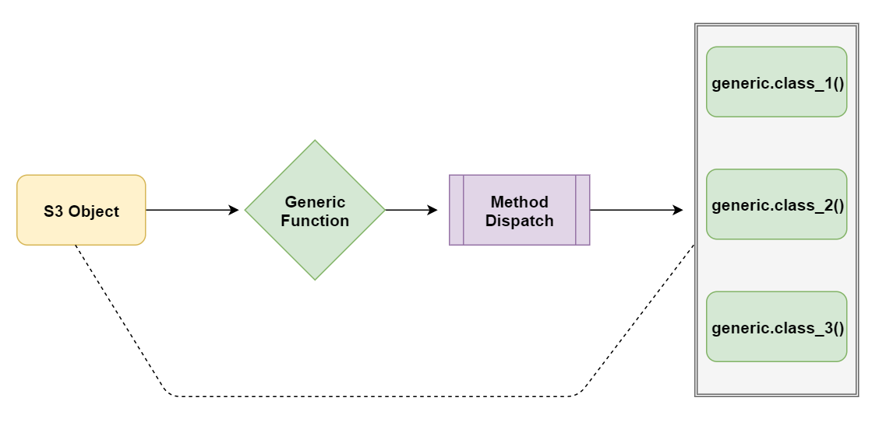
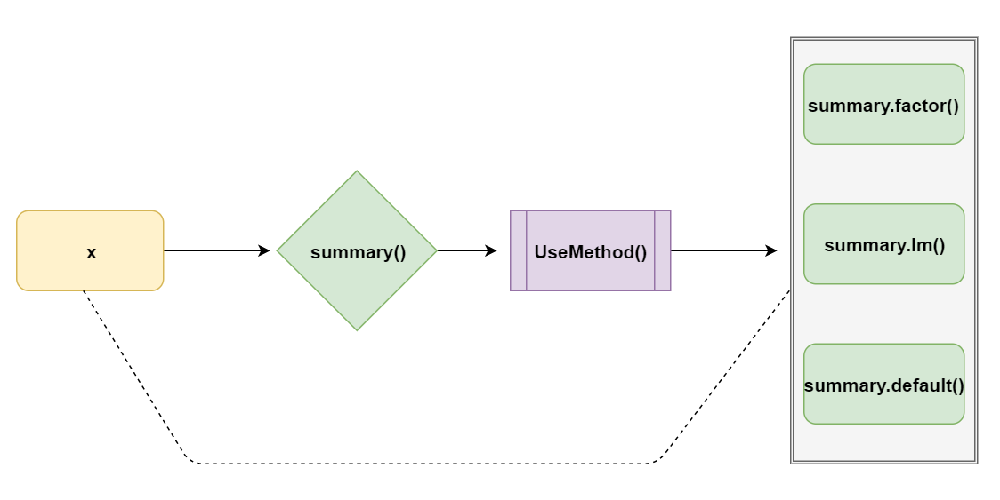
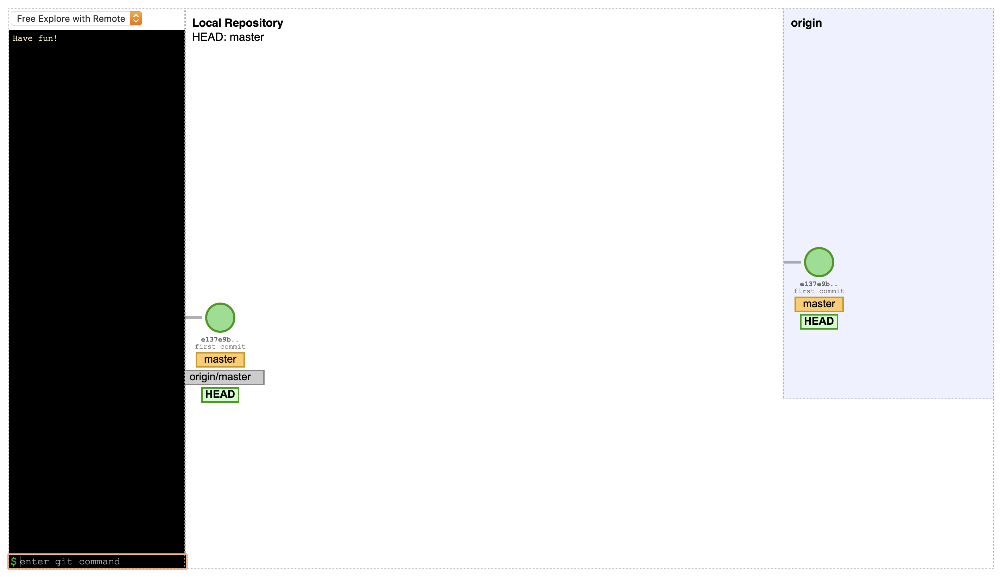

```{r include=FALSE}
knitr::opts_chunk$set(echo = TRUE, message = FALSE, warning = TRUE,
                      comment = "#>", highlight = TRUE,
                      fig.align = "center")
```

## Supplementary materials

Full video lecture available in Zoom Cloud Recordings

Additional resources

- [Object oriented program introduction](https://adv-r.hadley.nz/oo.html), Advanced R
- [Chapter 12](https://adv-r.hadley.nz/base-types.html), Advanced R
- [Sections 13.1 - 13.4](https://adv-r.hadley.nz/s3.html), Advanced R
- Create your own S3 vector classes with package [vctrs](https://vctrs.r-lib.org/articles/s3-vector.html)

---

## Announcements

- Homework 01 due tonight at 11:59pm ET

- Homework 02 out today

- Please watch the short video (posted in warpwire) on the core `dplyr` 
  functions before next lecture

---

class: inverse, center, middle

# Recall

---

## Attributes

Attributes attach metadata to an object. Factors, matrices, arrays, date-times,
and data frames are all vectors with specific attributes.

.small-text[
| Data Structure | Built On              | Attribute(s)                  | Quick creation                 |
|----------------|-----------------------|-------------------------------|--------------------------------|
| Matrix, Array  | Atomic vector         | `dim`                         | `matrix()`, `array()`          |
| Factor         | Atomic integer vector | `class`, `levels`             | `factor()`, `ordered()`        |
| Date           | Atomic double vector  | `class`                       | `as.Date()`                    |
| Date-times     | Atomic double vector  | `class`                       | `as.POSIXct()`, `as.POSIXlt()` |
| Data frame     | List                  | `class`, `names`, `row.names` | `data.frame()`                 |
]

We saw that factors, ordered factors, and data frames have a `class` attribute.
At the time, the role this played was unclear. Today we'll clear that up.

---

class: inverse, center, middle

# S3 object-oriented system

---

## Introduction

>S3 is R’s first and simplest OO system. S3 is informal and ad hoc, but there 
is a certain elegance in its minimalism: you can’t take away any part of it and 
still have a useful OO system. For these reasons, you should use it, unless you 
have a compelling reason to do otherwise. S3 is the only OO system used in the 
base and stats packages, and it’s the most commonly used system in 
CRAN packages.
<br><br>
Hadley Wickham

<br/>

R has many object-oriented programming (OOP) systems: S3, S4, R6, RC, etc.
We'll focus on S3.

---

## Polymorphism

How are certain functions able to handle different types of inputs?

```{r}
summary(c(1:10))
```
--

```{r}
summary(c("A", "A", "a", "B", "b", "C", "C", "C"))
```

--

```{r}
summary(factor(c("A", "A", "a", "B", "b", "C", "C", "C")))
```

---

```{r}
summary(data.frame(x = 1:10, y = letters[1:10]))
```

--

```{r}
summary(as.Date(0:10, origin = "2000-01-01"))
```

---

## Terminology

An **S3 object** is a **base type** object with at least a class attribute.

```{r}
sloop::otype(letters)
sloop::otype(longley)
sloop::otype(factor(c("A", "B", "O", "A", "B", "AB")))
```

Object-oriented objects will have a "class" attribute.

---

## Terminology

The implementation of a function for a specific class is known as a **method**.

```{r}
sloop::ftype(summary.data.frame)
sloop::ftype(summary.glm)
```

A **generic function** defines an interface that performs method dispatch. An
S3 object behaves differently from its underlying base type when passed into
a generic function.

---

## S3 system overview

<center>

</center>

---

## Example

What happens when `x` is passed into `summmary()`?

```{r eval=FALSE}
x <- factor(c("A", "A", "a", "B", "b", "C", "C", "C"))
summary(x)
```

<center>

</center>

---

## Example

```{r}
x <- factor(c("A", "A", "a", "B", "b", "C", "C", "C"))
summary(x)
```

```{r}
sloop::s3_dispatch(print(x))
```

--

```{r}
summary.factor(x)
summary.default(x)
```

---

## Example

```{r error=TRUE}
summary.lm(x)
summary.matrix(x)
```


---

## Working with the S3 OOP system

Approaches for working with the S3 system:

1. build methods off existing generics for a newly defined class;
   
2. define a new generic, build methods off existing classes;

3. or some combination of 1 and 2.

---

## Approach 1

First, define a class. S3 has no formal definition of a class. 
The class name can be any string.

```{r}
x <- "hello world"
attr(x, which = "class") <- "string"

x
```

--

Second, define methods that build off existing generic functions. Functions
`summary()` and `print()` are existing generic functions.

```{r}
sloop::ftype(summary)
sloop::ftype(print)
```

---

## Methods for class `string`

The format for defining methods should be `generic.class()`, where `generic`
is the name of the generic function and `class` is the name of your newly
defined class.

```{r}
summary.string <- function(x) {
   w <- length(unlist(strsplit(x, split = "")))
   cli::cat_line("  The total number of characters is ", w, col = "green")
   w
}
```

What does this do?

--

<br/>

```{r}
print.string <- function(x) {
  cli::cat_line("  ", unclass(x), col = "blue")
}
```

What does this do?

---

## Approach 1 in action

```{r eval=FALSE}
summary(x)
```

<font style="color:green">&nbsp;&nbsp;&nbsp;&nbsp; The total number of 
characters is 11</font>

```
[1] 11
```

--

```{r eval=FALSE}
print(x)
```

<font style="color:blue">&nbsp;&nbsp;&nbsp;&nbsp; hello world</font>


--

```{r}
y <- "hello world"
summary(y)
print(y)
```

---

## Approach 2

First, define a generic function.

```{r}
trim <- function(x, ...) {
   UseMethod("trim")
}
```

--

Second, define methods based on existing classes.

```{r}
trim.default <- function(x) {
   x[-c(1, length(x)), drop = TRUE]
}
```

What does this method do?

--

```{r}
trim.data.frame <- function(x, col = TRUE) {
   if (col){
      x[-c(1, dim(x)[2])]
   } else {
      x[-c(1, dim(x)[1]), ]
   }
}
```

What does this method do?

---

## Approach 2 in action

.tiny.pull-left[
```{r}
trim(1:10)
trim(c("a", "ab", "abc", "abcd"))
trim(c(T, F, F, F, T))
trim(factor(c("a", "ab", "abc", "abcd")))
```
]

--

.tiny.pull-right[
```{r}
df <- data.frame(x = 1:5, 
                 y = letters[1:5],
                 z = rep(T, 5))
df
```

```{r}
trim(df)
trim(df, col = FALSE)
```
]

---

## Exercises

1. Use function `sloop::ftype()` to see which of the following functions are
   S3 generics: `mean`, `summary`, `print`, `sum`, `plot`, `View`, `length`, 
   `[`.

2. Choose 2 of the S3 generics you identified above. How many methods exist for
   each? Use function `sloop::s3_methods_generic()`.
   
3. How many methods exist for classes `factor` and `data.frame`. 
   Use function `sloop::s3_methods_class()`.
   
4. Consider a class called accounting. If a numeric vector has this class,
   function `print()` should print the vector with a $ in front of each number
   and display values up to two decimals. Create a method for this class.
   The next slide provides a demonstration.

---
   
## Demo for exercise four

*Hint*:

```{r}
format(round(-3:3, digits = 2), nsmall = 2)
```

--

```{r echo=FALSE}
print.accounting <- function(x) {
  print(paste0("$", format(round(x, digits = 2), nsmall = 2)), quote = FALSE)
}
```

```{r}
x <- 1:5
class(x) <- "accounting"
print(x)
```

```{r}
y <- c(4.292, 134.1133, 50.111)
class(y) <- "accounting"
print(y)
```


???

## Part 4

```{r eval=FALSE}
print.accounting <- function(x) {
  print(paste0("$", format(round(x, digits = 2), nsmall = 2)), quote = FALSE)
}
```

```{r eval=FALSE}
x <- 1:5
class(x) <- "accounting"
print(x)
```

```{r eval=FALSE}
y <- c(4.292, 134.1133, 50.111)
class(y) <- "accounting"
print(y)
```

---

## Helpful tips

- When creating new classes follow Hadley's recommendation of constructor,
  validator, and helper functions. See section      
  [13.3](https://adv-r.hadley.nz/s3.html#s3-classes) in Advanced R.
  
- Only write a method if you own the generic or class.

- A method must have the same arguments as its generic, except if the
  generic has the `...` argument. 
  
  ```
  > print
    function (x, ...) 
    UseMethod("print")
    
  > print.data.frame
    function (x, ..., digits = NULL, quote = FALSE, right = TRUE, 
              row.names = TRUE, max = NULL)
  ```

- Package `sloop` has useful functions for finding generics and methods.
  Specifically, `ftype()`, `s3_methods_generic()`, `s3_methods_class()`.
  
- Use the generic function and let method dispatch do the work, i.e. use
  `print(x)` and not `print.data.frame(x)`, if `x` is a data frame.

---

## OOP systems summary

There are two main paradigms of object-oriented programming: encapsulated and
functional.

- **Encapsulated**: methods belong to objects or classes and method calls
  typically take the form `object.method(arg1, arg2)`. If you have a background
  in Python, this should feel familiar. The `R6` and `RC` OO systems are
  encapsulated systems.
  
- **Functional**: methods belong to generic functions and method calls
  typically take the form `generic(object, arg1, arg2)`. The `S3` and `S4`
  OO systems are examples of functional systems.

---

class: inverse, center, middle

# More git and GitHub

---

## Merge conflicts and pulling

- First, don't panic. The fix is usually simple.

- Merge conflicts happen when you merge branches that have competing commits, 
  and Git needs your help to decide which changes to incorporate in the final
  merge.
  
- To resolve the conflict, edit the conflicted file by removing the conflict
  markers and keeping the contents you want.
  
- Commit your changes and continue working.

- Use `git pull` before you begin working to ensure you have the most
  up-to-date versions from GitHub.

---

## Visualize git

https://git-school.github.io/visualizing-git/



---

## Tips for successful teamwork

1. Start early

2. Communicate early and often. Set up a private group direct message with
   your teammates in Slack.

3. Use the GitHub app in Slack to get notifications when changes happen to
   your team repository. Add the below command to your private group
   direct message.
   ```Slack
   /github subscribe sta323-523-sp21/<repo_name>
   ```
   To get help on all the GitHub app features in Slack, enter the below
   command in your private group direct message.
   ```Slack
   /github
   ```
   
4. Contribute and participate throughout the assignment's duration.

---

## References

1. R Language Definition. (2020). Cran.r-project.org.           
   https://cran.r-project.org/doc/manuals/r-release/R-lang.html

2. Wickham, H. (2020). Advanced R. https://adv-r.hadley.nz/


