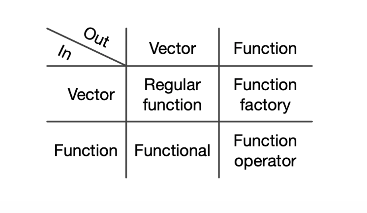

```{r include=FALSE}
knitr::opts_chunk$set(echo = TRUE, message = FALSE, warning = FALSE,
                      comment = "#>", highlight = TRUE,
                      fig.align = "center")
library(tidyverse)
```

## Supplementary materials

Full video lecture available in Zoom Cloud Recordings

Additional resources

- [Sections 9.1 - 9.4](https://adv-r.hadley.nz/functionals.html), Advanced R
- `purrr` [tutorial](https://jennybc.github.io/purrr-tutorial/index.html)
- `purrr` [cheat sheet](https://github.com/rstudio/cheatsheets/raw/master/purrr.pdf)

---

## Annoucements

- Homework 02 due today at 11:59pm ET

- Homework 03 out later this afternoon (same teams)
  - Focus: `dplyr`, `purrr`, and branching

- Team evaluation to go out during Homework 03

---

## What is a functional?

A functional is a function that takes a function as an input and returns
a vector as output.

Example 1:

```{r}
random <- function(fcn, ...) fcn(n = 5, ...)
```

--

Example 2:

```{r}
fixed_point <- function(f, x0, tol = .0001, ...) {
  y <- f(x0, ...)
  x_new <- x0
  
  while (abs(y - x_new) > tol) {
    x_new <- y
    y <- f(x_new, ...)
  }
  
  return(x_new)
}
```

---

```{r}
set.seed(23545)
random(rnorm)
random(rbinom, size = 40, prob = 0.5)
random(rexp)
```

--

```{r}
fixed_point(cos, 1)
fixed_point(sin, 0)
fixed_point(f = sqrt, x0 = .01, tol = .000000001)
```

---

## Functional programming

A functional is one property of first-class functions and part of what makes a 
language a functional programming language.

<center>

</center>

---

## Why use functionals?

Bjarne Stroustrup provides a concise response to this question.

>To become significantly more reliable, code must become more transparent. 
In particular, nested conditions and loops must be viewed with great suspicion. 
Complicated control flows confuse programmers. Messy code often hides bugs.

<br/><br/>

We'll be focusing on functionals that aide in automation. With enough care and 
effort, functionals soon will serve as a good alternative to your `for` loops.

---

class: inverse, center, middle

# Apply functions

---


## `[a-z]pply()` functions

The apply functions are a collection of tools for functional programming in R, 
they are variations of the `map` function found in many other languages.

- `lapply()`
- `sapply()`
- `apply()`
- `vapply()`
- `mapply()`
- `rapply()`
- `eapply()`

<i>
In many of the examples that follow, a functional is not required to accomplish
the task. R's vectorization capabilities can do the job. The examples are for
demonstration purposes only.
</i>

---

## `lapply()`

Usage: `lapply(X, FUN, ...)`

`lapply()` **returns a list** of the same length as `X`, each element of which 
is the result of applying `FUN` to the corresponding element of `X`.

<br/>

.pull-left[
```{r}
lapply(1:8, sqrt) %>% 
  str()
```
]

.pull-right[
```{r}
lapply(1:8, function(x) (x+1)^2) %>% 
  str()
```
]

---

Another perspective:

.pull-left[
```{r}
lapply(1:8, sqrt) %>% 
  str()
```
]

.pull-right[
```{r}
list(
  sqrt(1),
  sqrt(2),
  sqrt(3),
  sqrt(4),
  sqrt(5),
  sqrt(6),
  sqrt(7),
  sqrt(8)
) %>% str()
```
]


---

```{r}
lapply(1:8, function(x, pow) x ^ pow, 3) %>%
  str()
```

--

```{r}
pow <- function(x, pow) x ^ pow
lapply(1:8, pow, x = 2) %>%
  str()
```

---

## `sapply()`

Usage: `sapply(X, FUN, ..., simplify = TRUE, USE.NAMES = TRUE)`

`sapply()` is a *user-friendly* version and wrapper of `lapply`, it is a 
*simplifying* version of lapply. Whenever possible it will return a vector, 
matrix, or an array.

<br/>

```{r}
sapply(1:8, sqrt) %>% 
  round(2)
sapply(1:8, function(x) (x + 1)^2)
```

---

```{r}
sapply(1:8, function(x) c(x, x^2, x^3, x^4))
sapply(1:8, function(x) list(x, x^2, x^3, x^4))
```

---

```{r}
sapply(2:6, seq)
```

**Why do we have a list?**

<br/>

--

```{r}
sapply(2:6, seq, from = 1, length.out = 4)
```

---

## `[ls]apply()` and data frames

We can use these functions with data frames, the key is to remember that a
data frame is just a fancy list.

```{r}
df <-  data.frame(a = 1:6, b = letters[1:6], c = c(TRUE,FALSE))
lapply(df, class) %>% str()
sapply(df, class)
```

---

## More in the family

- `apply(X, MARGIN, FUN, ...)` - applies a function over the rows or columns 
  of a data frame, matrix, or array

- `vapply(X, FUN, FUN.VALUE, ..., USE.NAMES = TRUE)` - is similar to `sapply()`, 
  but has a enforced return type and size

- `mapply(FUN, ..., MoreArgs = NULL, SIMPLIFY = TRUE, USE.NAMES = TRUE)` -  like
  `sapply()` but will iterate over multiple vectors at the same time.

- `rapply(object, f, classes = "ANY", deflt = NULL, how = c("unlist", "replace", "list"), ...)` - a recursive version of `lapply()`, behavior depends largely on the `how` argument

- `eapply(env, FUN, ..., all.names = FALSE, USE.NAMES = TRUE)` -  apply a 
  function over an environment.

---

## Exercise

Using `sw_people` in package `repurrrsive`, extract the name of all 
characters using:

- a for loop,

- an apply function.

.tiny[
```{r}
library(repurrrsive)
str(sw_people[[1]])
```
]

*Hint:* The `[` and `[[` are functions.

???

## Solutions

```{r}
out <- character(length = length(sw_people))

for (i in seq_along(sw_people)) {
  out[i] <- sw_people[[i]]$name
}
```

```{r}
s_out <- sapply(sw_people, `[[`, "name")
```

---

class: inverse, center, middle

# Package `purrr`

---

## Why `purrr`?

- Member of the `tidyverse` package

- Improves the functional programming tools in R

- The `map()` family of functions can be used to replace loops 
  and `[a-z]pply()`
  
    - The first argument is always the data, so purrr works naturally with the 
      pipe.
      
    - All purrr functions are type-stable. They always return the advertised 
      output type, or they throw an error.
      
    - All `map()` functions either accept function, formulas 
      (used for succinctly generating anonymous functions), a character vector 
      (used to extract components by name), or a numeric vector 
      (used to extract by position).

<br/>

Load `tidyverse`.

```{r}
library(tidyverse)
```

---

## Map functions

Basic functions for looping over an object and returning a value 
(of a specific type).

| Map variant              | Description                            |
|--------------------------|----------------------------------------|
| `map()`                  | returns a list                         |
| `map_lgl()`              | returns a logical vector               |
| `map_int()`              | returns a integer vector               |
| `map_dbl()`              | returns a double vector                |
| `map_chr()`              | returns a character vector             |
| `map_df()` / `map_dfr()` | returns a data frame by row binding    |
| `map_dfc()`              | returns a data frame by column binding |

<br/>

All have leading arguments `.x` and `.f`, where `.x` is a list or atomic vector,
and `.f` is a function, formula, or vector.

---

## `map_*()` is strict

```{r}
x <- list(1L:5L, c(-2, .2, -20), c(pi, sqrt(2), 7))
```


```{r error=TRUE}
map_dbl(x, mean)
map_chr(x, mean)
map_lgl(x, mean)
map_int(x, mean)
```

---

```{r}
x <- list(1L:5L, c(-2, .2, -20), c(pi, sqrt(2), 7))
```

--

```{r error=TRUE}
map_dbl(x, `[`, 1)
map_chr(x, `[`, 3)
map_lgl(x, `[`, 1)
map_int(x, `[`, 1)
```

---

## Flexibility in `.f`

Argument `.f` in `map()` and `map_*()` can take a

- function name

- formula (one sided) / anonymous function, or a

- vector.

    - character vector
    - numeric vector
    - list
    
If it is a formula, it is converted to a function. Arguments can be
referenced in the following ways.

1. For a single argument function, use `.`
2. For a two argument function, use `.x` and `.y`
3. For more arguments, use `..1`, `..2`, `..3` etc.

---

## Examples


.pull-left[
Using `purrr`
```{r}
map_dbl(1:5, ~ . ^ .)
map_dbl(1:5, ~ .x ^ .x)
map2_dbl(1:5, -1:-5,  ~ .y ^ .x)
  
pmap_dbl(data.frame(1:5, 1:5, 1:5), 
         ~ ..1 + ..2 + ..3)
```
]

.pull-right[
Using Base R
```{r}
sapply(1:5, function(x) x ^ x)
sapply(1:5, function(x) x ^ x)
mapply(function(x, y) y ^ x, 
       x = 1:5, y = 1:5)
mapply(function(x, y, z) x + y + z, 
       x= 1:5, y = 1:5, z = 1:5)
```
]


---

## More examples

Consider `gh_users` from package `repurrrsive`.

```{r}
library(repurrrsive)
str(gh_users, max.level = 1)
```

---
.tiny[
```{r}
str(gh_users[[1]], max.level = 1)
```
]

---

What's happening here?

```{r}
map_chr(gh_users, "login")
map_chr(gh_users, 1)
map_chr(gh_users, 2)
```

--

<br/>

What if we want the `login` and `id`? Can we pass in `c(1, 2)`?

--

```{r error=TRUE}
map_chr(gh_users, c(1, 2))
```

---

```{r}
map(gh_users, `[`, c(1, 2)) %>% str()
```

```{r error=TRUE}
map(gh_users, `[[`, c(1, 2))
```

---

```{r}
map_dbl(gh_users, list(28, 1))
map_dbl(gh_users, list("following", 1))
```

--

<br/>

To make the above more clear:

```{r}
my_list <- list(
  list(x = 1:10, y = 6, z = c(9, 0)),
  list(x = 1:10, y = 6, z = c(-3, 2))
)
map_chr(my_list, list("z", 2))
map_chr(my_list, list(3, 1))
```

---

```{r}
map_df(gh_users, `[`, c(1, 2))
```


```{r}
map_df(gh_users, `[`, c("name", "type", "location"))
```

---

## More `map()` variants

- `walk()` - returns nothing, call function exclusively for its side effects
    ```{r eval=FALSE}
    datasets <- list(mtcars, faithful, longley, cars)
    file_names <- c("mtcars.csv", "faithful.csv", "longley.csv", "cars.csv")
    walk2(datasets, file_names, ~ write_csv(x = .x, path = .y))
    ```

- `modify()` - returns the same type as the input object, useful for data frames
    ```{r}
    df <- data_frame(x = 1:3, y = -1:-3)
    modify(df, ~ .x ^ 3)
    ```
    
- `map2()` and `pmap()` to vary two and n inputs, respectively

- `imap()` iterate over indices and values


---

## Exercises

Use `mtcars` and a single map or map variant to

- get the type of each variable,

- get the fourth row such that result is a character vector,

- compute the mean of each variable, and

- compute the mean and median for each variable such that the result is a
  data frame with the mean values in row 1 and the median values in row 2.

<br/>

Use a map function and your `mh_distance()` function from Homework 01
to iterate over both vectors `s` and `w` below.
```{r}
s <- c(26, 50123, 456.12, 8, 0)
w <- c(22, 50000, 451.00, 88, 0)
```
  
???

## Solutions

```{r}
map_chr(mtcars, typeof)
map_chr(mtcars, 4)
map_dbl(mtcars, mean)
map_df(mtcars, ~ c(mean(.), median(.)))
```

---

## References

1. Grolemund, G., & Wickham, H. (2021). R for Data Science.         
   https://r4ds.had.co.nz/

2. Wickham, H. (2021). Advanced R. https://adv-r.hadley.nz/

