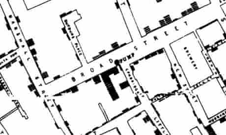

```{r include=FALSE}
knitr::opts_chunk$set(echo = TRUE, message = FALSE, warning = FALSE,
                      comment = "#>", highlight = TRUE,
                      fig.align = "center")
options(htmltools.preserve.raw = FALSE)

library(sf)
library(tidyverse)
library(patchwork)
```

## Supplementary materials

Full video lecture available in Zoom Cloud Recordings

Additional resources

- Simple Features for R [vignettes](https://r-spatial.github.io/sf/)
- [CRS in R](https://www.nceas.ucsb.edu/~frazier/RSpatialGuides/OverviewCoordinateReferenceSystems.pdf) 
  by Melanie Frazier
- [Leaflet for R](https://rstudio.github.io/leaflet/)

---

## Data

Data for today is available at

- Package `sf`
  - NC counties, births, sudden infant deaths
    ```
    nc <- st_read(system.file("shape/nc.shp", package = "sf"))
    ```

- [NC OneMap](https://www.nconemap.gov) - lots of spatial data on all things NC
  
  - [NC PMTW Streams 2020](https://www.nconemap.gov/datasets/0cc135e6c6244c9e9646b45ee3cb6c1e_0)
  - [NC game lands](https://www.nconemap.gov/datasets/ncwrc::game-lands-general)

- [London cholera data](http://blog.rtwilson.com/john-snows-cholera-data-in-more-formats/)

---

class: inverse, center, middle

# A little history

---

## Spatial data analysis then

John Snow's map that changed the world...

<br/>

<center>

</center>

Backstory: read more [here](https://www.theguardian.com/news/datablog/2013/mar/15/john-snow-cholera-map)

---

## Spatial data analysis now

Spatial data analysis and visualization was a critical component in Operation
Neptune Spear.

<br/>

<center>

</center>

Backstory: read more [here](https://www.theatlantic.com/politics/archive/2011/05/the-little-known-agency-that-helped-kill-bin-laden/238454/)

---

class: inverse, center, middle

# Introduction

---

## Spatial data is different

Our **typical tidy data frame**:

.tiny[
```{r echo=FALSE}
nycflights13::flights
```
]

---

## Spatial data is different

A **simple features object**:

.tiny[
```{r echo=FALSE}
nc <- st_read(system.file("shape/nc.shp", package = "sf"), quiet = T)
nc %>% 
  select(AREA:NAME)
```
]

---

Another **simple features** object:

.tiny[
```{r echo=FALSE}
nc_pmtw <- st_read("data/PMTW_Streams_2020.shp", quiet = TRUE)
nc_pmtw %>% 
  select(Displ_Name, FIRST_WRC_)
```
]

---

Yet another **simple features** object:

.tiny[
```{r echo=FALSE}
nc_gamelands <- st_read("data/Game_Lands_-_general.shp", quiet = TRUE)
nc_gamelands %>% 
  select(GML_HAB, SUM_ACRES)
```
]

---

## Spatial data plotting needs care

```{r echo=FALSE, out.width="100%", fig.height=5}

lcc <- "+proj=lcc +lat_1=20 +lat_2=60 +lat_0=40 +lon_0=-96 +x_0=0 +y_0=0 +ellps=GRS80 +datum=NAD83 +units=m +no_defs"
nc_lcc <- nc %>% st_transform(crs = lcc)
aea <- "+proj=aea +lat_1=20 +lat_2=60 +lat_0=40 +lon_0=-96 +x_0=0 +y_0=0 +ellps=GRS80 +datum=NAD83 +units=m +no_defs"
nc_aea <- nc %>% st_transform(crs = aea)
rob <- "+proj=robin +lon_0=0 +x_0=0 +y_0=0 +ellps=WGS84 +datum=WGS84 +units=m +no_defs"
nc_rob <- nc %>% st_transform(crs = rob)

par(mar=c(3,2,2,1),mfrow=c(2,2))
plot(st_geometry(nc), graticule = T, axes = T)
plot(st_geometry(nc_lcc), graticule = T, axes = T)
plot(st_geometry(nc_aea), graticule = T, axes = T)
plot(st_geometry(nc_rob), graticule = T, axes = T)
```

```{r echo=FALSE}
dev.off()
```


---

```{r echo=FALSE, out.width="100%", fig.height=6}
nc <- st_transform(nc, st_crs(nc_gamelands))
durham <- nc[nc$NAME == "Durham", ]
durham <- nc[durham, ]
durham_gamelands <- nc_gamelands[durham, ]
plot(st_geometry(durham), axes = T, col = "#add8e6",
     main = "Durham Area Counties")
```

---

```{r echo=FALSE, out.width="100%", fig.height=6}
durham_gamelands_2 <- durham_gamelands %>% st_transform(crs = "+proj=utm +zone=17 +ellps=GRS80 +towgs84=0,0,0,0,0,0,0 +units=m +no_defs")
plot(st_geometry(durham_gamelands_2), axes = T, col = "#ff6700",
     main = "Durham Area Public Game Lands")
```

---

class: center, middle

## Can we combine the two plots?

---

## What happened?

```{r echo=FALSE, out.width="100%", fig.height=5.5}
plot(st_geometry(durham), axes = T, main = "Durham Area Public Game Lands")
plot(st_geometry(durham_gamelands_2), add = T, axes = T, col = "#ff6700")
```

---

class: center, middle

## We can combine them, but more care is needed

---

```{r echo=FALSE, out.width="100%", fig.height=5.5}
plot(st_geometry(durham), axes = T, main = "Durham Area Public Game Lands")
plot(st_geometry(durham_gamelands), add = T, axes = T, col = "#ff6700")
```

---

## Spatial data challenges

1. Different data types exist.

2. Special attention must be given to the coordinate reference system (CRS).

3. Manipulating spatial data objects is similar but not identical to 
   manipulating data frame objects.
   
---

class: inverse, center, middle

# Spatial data and R

---

## Analysis of spatial data in R

.pull-left[

<br/>

- Package `raster` contains classes and tools for handling spatial raster data.

<br/><br/>

- Package `sf` combines the functionality of `sp`, `rgdal`, and `rgeos` 
  into a single package based on tidy simple features.

]

.pull-right[


]

<br/>

Whether or not you use vector or raster data depends on the type of problem 
and the data source. Our focus will be on vector data and package `sf`. 

*Source:* https://commons.wikimedia.org/wiki/File:Raster_vector_tikz.png

---

## Installing package `sf`

From https://r-spatial.github.io/sf/index.html

**Windows**

Installing `sf` from source works under windows when Rtools is installed. 
This downloads the system requirements from rwinlib.

**MacOS**

```bash
brew install pkg-config
brew install gdal
```
Once gdal is installed, you will be able to install sf package from source in R.

**Linux**

For Unix-alikes, GDAL (>= 2.0.1), GEOS (>= 3.4.0) and Proj.4 (>= 4.8.0) are 
required.

---

## Features and simple features

- A **feature** is a thing or object in the real world: a house, a city, a park,
  a forest, etc.
<br/><br/>
- A **simple feature** as defined by OpenGIS Abstract specification is to have 
  both spatial and non-spatial attributes. Spatial attributes are geometry 
  valued, and simple features are based on 2D geometry with linear 
  interpolation between vertices.
<br/><br/>

.tiny[
```{r eval=FALSE}
Simple feature collection with 1858 features and 2 fields
geometry type:  MULTILINESTRING
dimension:      XYZ
bbox:           xmin: -9383722 ymin: 4162088 xmax: -8947168 ymax: 4381832
z_range:        zmin: 0 zmax: 0
projected CRS:  WGS 84 / Pseudo-Mercator
First 10 features:
          Displ_Name                      FIRST_WRC_                       geometry
1    Big Sandy Creek    Delayed Harvest Trout Waters MULTILINESTRING Z ((-901773... #<<
2       Helton Creek    Delayed Harvest Trout Waters MULTILINESTRING Z ((-907349...
3       Little River    Delayed Harvest Trout Waters MULTILINESTRING Z ((-903290...
4    Cranberry Creek Hatchery Supported Trout Waters MULTILINESTRING Z ((-904529...
5     Big Pine Creek Hatchery Supported Trout Waters MULTILINESTRING Z ((-901483...
6      Bledsoe Creek Hatchery Supported Trout Waters MULTILINESTRING Z ((-903607...
7        Brush Creek Hatchery Supported Trout Waters MULTILINESTRING Z ((-901813...
8               <NA> Hatchery Supported Trout Waters MULTILINESTRING Z ((-902513...
9  (Big) Glade Creek Hatchery Supported Trout Waters MULTILINESTRING Z ((-902642...
10      Little River Hatchery Supported Trout Waters MULTILINESTRING Z ((-903124...
```
]

---

## Simple features examples

```{r echo=FALSE}
pt <- st_point(c(30, 10))
ls <- st_linestring(matrix(c(30, 10, 10, 30, 40, 40), byrow = TRUE, ncol =
                            2))
poly <- st_polygon(list(matrix(
  c(30, 10, 40, 40, 20, 40, 10, 20, 30, 10),
  ncol = 2,
  byrow = TRUE
)))
poly_hole <- st_polygon(list(matrix(
  c(35, 10, 45, 45, 15, 40, 10, 20, 35, 10),
  ncol = 2,
  byrow = TRUE
),
matrix(
  c(20, 30, 35, 35, 30, 20, 20, 30),
  ncol = 2,
  byrow = TRUE
)))

pts <- st_multipoint(matrix(
  c(10, 40, 40, 30, 20, 20, 30, 10),
  ncol = 2,
  byrow = TRUE
))
lss <- st_multilinestring(list(matrix(
  c(10, 10, 20, 20, 10, 40), ncol = 2, byrow = TRUE
),
matrix(
  c(40, 40, 30, 30, 40, 20, 30, 10),
  ncol = 2,
  byrow = TRUE
)))
polys <- st_multipolygon(list(list(matrix(
  c(30, 20, 45, 40, 10, 40, 30, 20),
  ncol = 2,
  byrow = TRUE
)),
list(matrix(
  c(15, 5, 40, 10, 10, 20, 5, 10, 15, 5),
  ncol = 2,
  byrow = TRUE
))))
polys_hole <- st_multipolygon(list(list(matrix(
  c(40, 40, 20, 45, 45, 30, 40, 40),
  ncol = 2,
  byrow = TRUE
)),
list(
  matrix(
    c(20, 35, 10, 30, 10, 10, 30, 5, 45, 20, 20, 35),
    ncol = 2,
    byrow = TRUE
  ),
  matrix(
    c(30, 20, 20, 15, 20, 25, 30, 20),
    ncol = 2,
    byrow = TRUE
  )
)))
```

```{r echo=FALSE, fig.width=8, fig.height=8, fig.align="center", out.width="100%"}
par(mar = c(1, 1, 2, 1), mfrow = c(4, 4))

plot(pt,
     axes = FALSE,
     main = "Point",
     pch = 16)
box()
plot(ls, axes = FALSE, main = "Linestring")
box()
plot(poly,
     axes = FALSE,
     col = "lightgrey",
     main = "Polygon")
box()
plot(poly_hole,
     axes = FALSE,
     col = "lightgrey",
     main = "Polygon w/ Hole(s)")
box()

plot(pts,
     axes = FALSE,
     main = "Multipoint",
     pch = 16)
box()
plot(lss, axes = FALSE, main = "Multilinestring")
box()
plot(polys,
     axes = FALSE,
     col = "lightgrey",
     main = "Multipolygon")
box()
plot(polys_hole,
     axes = FALSE,
     col = "lightgrey",
     main = "Multipolygon w/ Hole(s)")
box()
```

```{r echo=FALSE}
dev.off()
```


---

## `sf` objects

.tiny[
```{r}
nc <- st_read(system.file("shape/nc.shp", package = "sf"), quiet = TRUE)
nc
```
]

---

## Class and other attributes: `sf`

```{r}
class(nc)
```

```{r}
names(attributes(nc))
```


---

## `sfc` objects

```{r message=TRUE}
nc_polygons <- st_geometry(nc)
nc_polygons
```

---

## Class and other attributes: `sfc`

```{r}
class(nc_polygons)
```

```{r}
names(attributes(nc_polygons))
```

<br/>

--

We see that `nc` has a class attribute `sf`, and object `nc_polygons` has a
class attribute `sfc`. What methods are available?

---

```{r}
sloop::s3_methods_class("sf") %>% 
  print(n = 20)
```

---

```{r}
sloop::s3_methods_class("sfc") %>% 
  print(n = 20)
```

---

## Reading and writing spatial data

- `st_read()` / `st_write()`, Shapefile, GeoJSON, KML, ...

- `st_as_sfc()` 

- `st_as_text()`,  well-known text format

- `st_as_binary()`, well-known binary format

<br/><br/><br>

See https://r-spatial.github.io/sf/articles/sf2.html for the full
set of driver availability.

---

## Plotting with `plot()`

```{r fig.height=6}
plot(nc, max.plot = 14)
```

---

```{r fig.width=7, fig.height=6}
plot(nc["NAME"])
```

---

```{r fig.width=12, fig.height=6}
par(oma=c(0,2,0,0))
plot(nc["AREA"], graticule = TRUE, axes = TRUE, las = 1)
```

---

## What is happening with `[` and the `sf` object?

```{r}
nc["AREA"]
```

---

```{r}
nc$AREA
```

---

```{r fig.width=12, fig.height=6}
par(oma=c(0,2,0,0))
plot(nc["AREA"], col = "lightblue", graticule = TRUE, 
     axes = TRUE, las = 1)
```

---

```{r fig.width=12, fig.height=6}
par(oma=c(0,2,0,0))
plot(st_geometry(nc), graticule = TRUE, axes = TRUE, las = 1)
```

---

## Plotting with `ggplot()`

```{r fig.width=9, fig.height=6}
ggplot(nc) +
  geom_sf() + #<<
  theme_bw(base_size = 16)
```

---

```{r fig.width=12, fig.height=8}
ggplot(nc) +
  geom_sf(aes(fill = AREA)) + #<<
  scale_fill_gradient(low = "#fee8c8", high = "#7f0000") +
  theme_bw(base_size = 16)
```

---

## Patchwork works

```{r echo=FALSE, fig.width=12, fig.height=8}
p1 <- ggplot(nc) +
  geom_sf(aes(fill = SID74)) +
  scale_fill_gradient(low = "#fff7f3", high = "#49006a") +
  theme_bw(base_size = 16)
  
p2 <- ggplot(nc) +
  geom_sf(aes(fill = SID79)) +
  scale_fill_gradient(low = "#fff7f3", high = "#49006a") +
  theme_bw(base_size = 16)

p1 / p2
```

---

## Patchwork works

Aside: What is wrong with the last set of figures?

--

<br/>

Code for previous slide:

```{r eval=FALSE}
p1 <- ggplot(nc) +
  geom_sf(aes(fill = SID74)) +
  scale_fill_gradient(low = "#fff7f3", high = "#49006a") +
  theme_bw(base_size = 16)
  
p2 <- ggplot(nc) +
  geom_sf(aes(fill = SID79)) +
  scale_fill_gradient(low = "#fff7f3", high = "#49006a") +
  theme_bw(base_size = 16)

p1 / p2
```

---

## Plotting with `leaflet`

```{r}
library(leaflet)
```

--

```{r eval=FALSE}
# create a color palette function
pal <- colorNumeric(palette = "Blues", domain = nc$BIR74)

leaflet(nc, width = "100%") %>% 
  addTiles() %>% 
  addPolygons(color = "grey") %>% 
  addPolygons(stroke       = FALSE, 
              fillOpacity  = 0.8, 
              smoothFactor = 0.2, 
              color        = ~pal(BIR74)) %>% 
  addLegend(position = "bottomright", 
            pal      = pal, 
            values   = ~BIR74, opacity = 0.8)
```

---

## Plotting with `leaflet`

```{r echo=FALSE, fig.width=9}
# create a color palette function
pal <- colorNumeric(palette = "Blues", domain = nc$BIR74)

leaflet(nc, width = "100%") %>% 
  addTiles() %>% 
  addPolygons(color = "grey") %>% 
  addPolygons(stroke       = FALSE, 
              fillOpacity  = 0.8, 
              smoothFactor = 0.2, 
              color        = ~pal(BIR74)) %>% 
  addLegend(position = "bottomright", 
            pal      = pal, 
            values   = ~BIR74, opacity = 0.8)
```

---

## Exercise

Use `ggplot` to create a choropleth map for the proportion of sudden infant 
deaths, for the period of July 1, 1974 to June 30, 1979.

```{r echo=FALSE, out.width="100%", fig.height=5}
nc %>% 
  select(BIR74, SID74) %>% 
  mutate(SID74_prop = SID74 / (BIR74 + SID74)) %>% 
  ggplot() +
  geom_sf(aes(fill = SID74_prop)) +
  scale_fill_gradient(low = "#fff7f3", high = "#49006a") +
  labs(title = "July 1, 1974 to June 30, 1979", 
       fill  = "",
       subtitle = "Proportion of SID by county") +
  theme_void() +
  theme(plot.margin = margin(0, 1, 0, 1, "cm"))
```

???

```{r eval=FALSE}
nc %>% 
  select(BIR74, SID74) %>% 
  mutate(SID74_prop = SID74 / (BIR74 + SID74)) %>% 
  ggplot() +
  geom_sf(aes(fill = SID74_prop)) +
  scale_fill_gradient(low = "#fff7f3", high = "#49006a") +
  labs(title = "July 1, 1974 to June 30, 1979", 
       fill  = "",
       subtitle = "Proportion of SID by county") +
  theme_void() +
  theme(plot.margin = margin(0, 1, 0, 1, "cm"))
```

---

class: inverse, center, middle

# Map layers

---

## PMTW streams data

The North Carolina Wildlife Resources Commission developed the Public Mountain 
Trout Waters (PMTW) digital data to enhance planning and management of trout 
waters. The GIS dataset depicts the trout regulations in effect on trout waters
(streams and impoundments) managed under the PMTW program as listed in 
2020-2021.

We can directly download and unzip the shapefile via

```{r eval=FALSE}
download.file(str_c("https://opendata.arcgis.com/datasets/", 
                    "0cc135e6c6244c9e9646b45ee3cb6c1e_0.zip", 
                    "?outSR=%7B%22latestWkid%22%3A3857%2C%22",
                    "wkid%22%3A102100%7D"),
              destfile = "data/pmtw.zip")

unzip("data/pmtw.zip", exdir = "data/")
```

--

To see the available files

```{r}
list.files(path = "data/", pattern = "PMTW_*")
```

---

## Read in the shapefile

```{r}
nc_pmtw <- st_read("data/PMTW_Streams_2020.shp", quiet = TRUE)
```


```{r}
glimpse(nc_pmtw)
```

---

## Metadata for each `sf` object

`nc`:

```{r eval=FALSE}
Simple feature collection with 100 features and 14 fields
geometry type:  MULTIPOLYGON
dimension:      XY
bbox:           xmin: -84.32385 ymin: 33.88199 xmax: -75.45698 ymax: 36.58965
geographic CRS: NAD27 #<<
```

`nc_pmtw`:

```{r eval=FALSE}
Simple feature collection with 1858 features and 10 fields
geometry type:  MULTILINESTRING
dimension:      XYZ
bbox:           xmin: -9383722 ymin: 4162088 xmax: -8947168 ymax: 4381832
z_range:        zmin: 0 zmax: 0
projected CRS:  WGS 84 / Pseudo-Mercator #<<
```

---

## Check the CRS

```{r eval=FALSE}
st_crs(nc)
```

```{r eval=FALSE}
Coordinate Reference System:
  User input: NAD27 
  wkt:
GEOGCRS["NAD27",
    DATUM["North American Datum 1927",
        ELLIPSOID["Clarke 1866",6378206.4,294.978698213898,
            LENGTHUNIT["metre",1]]],
    PRIMEM["Greenwich",0,
        ANGLEUNIT["degree",0.0174532925199433]],
    CS[ellipsoidal,2],
        AXIS["latitude",north,
            ORDER[1],
            ANGLEUNIT["degree",0.0174532925199433]],
        AXIS["longitude",east,
            ORDER[2],
            ANGLEUNIT["degree",0.0174532925199433]],
    ID["EPSG",4267]]
```


---

.tiny[
```{r eval=FALSE}
st_crs(nc_pmtw)
```

```{r eval=FALSE}
Coordinate Reference System:
  User input: WGS 84 / Pseudo-Mercator 
  wkt:
PROJCRS["WGS 84 / Pseudo-Mercator",
    BASEGEOGCRS["WGS 84",
        DATUM["World Geodetic System 1984",
            ELLIPSOID["WGS 84",6378137,298.257223563,
                LENGTHUNIT["metre",1]]],
        PRIMEM["Greenwich",0,
            ANGLEUNIT["degree",0.0174532925199433]],
        ID["EPSG",4326]],
    CONVERSION["Popular Visualisation Pseudo-Mercator",
        METHOD["Popular Visualisation Pseudo Mercator",
            ID["EPSG",1024]],
        PARAMETER["Latitude of natural origin",0,
            ANGLEUNIT["degree",0.0174532925199433],
            ID["EPSG",8801]],
        PARAMETER["Longitude of natural origin",0,
            ANGLEUNIT["degree",0.0174532925199433],
            ID["EPSG",8802]],
        PARAMETER["False easting",0,
            LENGTHUNIT["metre",1],
            ID["EPSG",8806]],
        PARAMETER["False northing",0,
            LENGTHUNIT["metre",1],
            ID["EPSG",8807]]],
    CS[Cartesian,2],
        AXIS["easting (X)",east,
            ORDER[1],
            LENGTHUNIT["metre",1]],
        AXIS["northing (Y)",north,
            ORDER[2],
            LENGTHUNIT["metre",1]],
    USAGE[
        SCOPE["unknown"],
        AREA["World - 85°S to 85°N"],
        BBOX[-85.06,-180,85.06,180]],
    ID["EPSG",3857]]
```
]

---

## Coordinate reference systems (CRS)

- CRS provide a standardized way of describing locations.

- Different CRS arise from various ways data were gathered, the locations,
  and purposes of the data.
  
- A CRS is comprised of
    - an ellipsoid, to define the earth's shape;
    - a datum, to define the origin and orientation of coordinate axes;
    - a projection, to go from 3D to 2D.

- It is important that you transform your spatial data to a common CRS before
  plotting.

---

## Transform CRS

```{r}
nc_pmtw <- st_transform(nc_pmtw, crs = st_crs(nc))
```

--

Check they are equal:

```{r}
st_crs(nc) == st_crs(nc_pmtw)
```

---

class: center, middle

```{r echo=FALSE, fig.width=12, fig.height=8}
plot(st_geometry(nc), axes = T, las = 1, main = "NC PMTW Streams",
     cex.main = 3, cex.lab = 2, cex.axis = 1.5)

plot(st_geometry(nc_pmtw), 
     add = T, #<<
     col = "#3BB3D0")

legend("bottomleft", legend = "Trout streams", fill = "#3BB3D0")
```

---

## Code: map overlay with `plot()`

```{r fig.show='hide'}
plot(st_geometry(nc), axes = T, las = 1, main = "NC PMTW Streams",
     cex.main = 3, cex.lab = 2, cex.axis = 1.5)

plot(st_geometry(nc_pmtw), 
     add = T, #<<
     col = "#3BB3D0")

legend("bottomleft", legend = "Trout streams", fill = "#3BB3D0")
```

---

class: center, middle

```{r echo=FALSE, fig.width=12, fig.height=8}
library(extrafont)
loadfonts()

ggplot(nc) +
  geom_sf(alpha = 0.2) +
  geom_sf(data = nc_pmtw, aes(color = FIRST_WRC_), size = 1.5) +
  labs(title   = "NC PMTW Streams", 
       color   = "Stream designation",
       caption = str_c("Public mountain trout waters are only in ", 
                       "western North Carolina")) +
  theme_void() +
  xlim(c(-84.5, -80.5)) +
  ylim(c(34.8, 36.8)) +
  theme(legend.position  = c(0.30, 0.80),
        plot.title       = element_text(size = 50, family = "Impact"),
        legend.text      = element_text(size = 16, family = "Comic Sans MS"),
        legend.title     = element_text(size = 20, family = "Comic Sans MS"),
        plot.caption     = element_text(size = 12, family = "Comic Sans MS"))
```

---

## Code: map overlay with `ggplot2`

```{r eval=FALSE}
# use some fancy fonts
library(extrafont)
loadfonts()

ggplot(nc) +
  geom_sf(alpha = 0.2) +
  geom_sf(data = nc_pmtw, aes(color = FIRST_WRC_), size = 1.5) +
  labs(title   = "NC PMTW Streams", 
       color   = "Stream designation",
       caption = str_c("Public mountain trout waters are only in ", 
                       "western North Carolina")) +
  theme_void() +
  xlim(c(-84.5, -80.5)) + # zoom long
  ylim(c(34.8, 36.8)) +   # zoom lat
  # custom theme
  theme(legend.position  = c(0.25, 0.80),
        plot.title       = element_text(size   = 50, 
                                        family = "Impact"),
        legend.text      = element_text(size   = 16, 
                                        family = "Comic Sans MS"),
        legend.title     = element_text(size   = 20, 
                                        family = "Comic Sans MS"),
        plot.caption     = element_text(size   = 12, 
                                        family = "Comic Sans MS"))
```

---

## Exercise

Recreate John Snow's cholera map showing the cholera death locations and the
water pump locations.

Download the data (you should have a directory named `data/`):

```{r eval=FALSE}
download.file("http://rtwilson.com/downloads/SnowGIS_SHP.zip",
              destfile = "data/john_snow.zip")
unzip("data/john_snow.zip", exdir = "data/")
```

Read in the data:

```{r eval=FALSE}
cholera <- st_read("data/SnowGIS_SHP/Cholera_Deaths.shp", quiet = TRUE)
pumps <- st_read("data/SnowGIS_SHP/Pumps.shp", quiet = TRUE)
```

Before you start, check that both `sf` objects have the same CRS.

---

## References

1. Interactive Viewing of Spatial Data in R. (2021).         
   https://r-spatial.github.io/mapview/index.html.
   
2. "Leaflet For R - Introduction". Rstudio.Github.Io, 2021,         
    https://rstudio.github.io/leaflet/.
   
3. Melanie Frazier. Coordinate Reference Systems in R. 
   https://www.nceas.ucsb.edu/~frazier/RSpatialGuides/OverviewCoordinateReferenceSystems.pdf.
   
4. Simple Features for R. (2021). 
   https://r-spatial.github.io/sf/.

