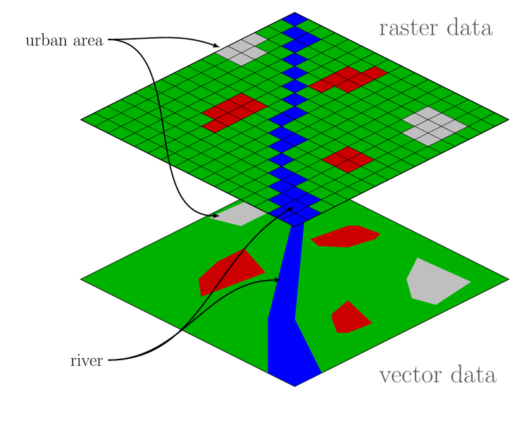

```{r include=FALSE}
knitr::opts_chunk$set(echo = TRUE, message = FALSE, warning = FALSE,
                      comment = "#>", highlight = TRUE,
                      fig.align = "center")
```

## Supplementary materials

Full video lecture available in Zoom Cloud Recordings

Additional resources

- Simple Features for R [vignettes](https://r-spatial.github.io/sf/)
- [CRS in R](https://www.nceas.ucsb.edu/~frazier/RSpatialGuides/OverviewCoordinateReferenceSystems.pdf) 
  by Melanie Frazier
- [Leaflet for R](https://rstudio.github.io/leaflet/)

---

## Data

Data for today is available at

- Package `sf`
  - NC counties

- [NC OneMap](https://www.nconemap.gov) - lots of spatial data on all things NC
  - [NC PMTW Streams 2020](https://www.nconemap.gov/datasets/0cc135e6c6244c9e9646b45ee3cb6c1e_0)
  - [NC Public Schools](https://www.nconemap.gov/datasets/public-schools)
  
---

## Access data

Create a folder `data/`.

NC PMTW Streams:

.small[
```{r eval=FALSE}
download.file(paste0("https://opendata.arcgis.com/datasets/", 
                    "0cc135e6c6244c9e9646b45ee3cb6c1e_0.zip", 
                    "?outSR=%7B%22latestWkid%22%3A3857%2C%22",
                    "wkid%22%3A102100%7D"),
              destfile = "data/pmtw.zip")

unzip("data/pmtw.zip", exdir = "data/")
file.remove("data/pmtw.zip")
```
]

NC Public Schools:

.small[
```{r eval=FALSE}
download.file(paste0("https://opendata.arcgis.com/datasets/", 
                    "dea6ff0e8b4743a0ba361e13a85a4c70_3.zip", 
                    "?outSR=%7B%22latestWkid%22%3A32119%2C%22",
                    "wkid%22%3A32119%7D"),
              destfile = "data/schools.zip")

unzip("data/schools.zip", exdir = "data/")
file.remove("data/schools.zip")
```
]

---

## Read data and load packages

Packages

```{r}
library(tidyverse)
library(sf)
library(janitor)
```

Read in the shapefiles

```{r}
nc_counties <- st_read(system.file("shape/nc.shp", package = "sf"), 
                       quiet = T) %>% 
  clean_names() %>% 
  select(name, area)
```

```{r}
nc_pmtw <- st_read("data/PMTW_Streams_2020.shp", quiet = T) %>%
  clean_names() %>% 
  select(name = displ_name, designation = first_wrc, length = shape_len)
```

```{r}
nc_schools <- st_read("data/Public_Schools.shp", quiet = T) %>% 
  clean_names()
```

---

class: inverse, center, middle

# Recall

---

## Spatial data is different

Our **typical tidy data frame**:

.tiny[
```{r echo=FALSE}
nycflights13::flights
```
]

---

## Spatial data is different

A **simple features object**:

.tiny[
```{r echo=FALSE}
nc <- st_read(system.file("shape/nc.shp", package = "sf"), quiet = T)
nc %>% 
  select(AREA:NAME)
```
]

---

## Analysis of spatial data in R

.pull-left[

<br/>

- Package `raster` contains classes and tools for handling spatial raster data.

<br/><br/>

- Package `sf` combines the functionality of `sp`, `rgdal`, and `rgeos` 
  into a single package based on tidy simple features.

]

.pull-right[




]

<br/>

Whether or not you use vector or raster data depends on the type of problem 
and the data source. Our focus will be on vector data and package `sf`. 

*Source:* https://commons.wikimedia.org/wiki/File:Raster_vector_tikz.png

---

class: inverse, center, middle

# Data processing

---

## Align the CRS

```{r}
st_crs(nc_counties)[1]
st_crs(nc_pmtw)[1]
st_crs(nc_schools)[1]
```

--

<br/>

Let's put everything on `NAD83` - [more on these datums](https://gisgeography.com/geodetic-datums-nad27-nad83-wgs84/)

---

## Align the CRS (continued)

```{r}
nc_counties <- st_transform(nc_counties, crs = st_crs(nc_schools))
nc_pmtw <- st_transform(nc_pmtw, crs = st_crs(nc_schools))
```

--

```{r}
st_crs(nc_counties)[1]
st_crs(nc_pmtw)[1]
st_crs(nc_schools)[1]
```

---

class: inverse, center, middle

# Geometric confirmation

---

## Touches

```{r}
durham <- nc_counties %>% 
  filter(str_detect(name, "^Durham"))
```

--

```{r eval=FALSE}
st_touches(x = durham, y = nc_counties)
```

```
#> Sparse geometry binary predicate list of length 1, 
#> where the predicate was `touches'
#>  1: 13, 14, 29, 37, 48
```

--

Setting the argument `sparse = FALSE` will return a logical matrix. Element
`i, j` is `TRUE` when geometry feature `i` and `j` touch.

---

## Touches

What are the counties that `touch` Durham?

```{r}
nc_counties %>% 
  filter(st_touches(durham, nc_counties, sparse = FALSE))
```

--

Where is Durham?

--

Specifically, `st_touches()` checks if `x` and `y` share a common point but
their interiors do not intersect.

---

## Contains

Recall that `nc_schools` has a point geometry. Let's identify the Durham
public schools. First, let's check if there are any schools in Durham.

```{r}
durham %>% 
  st_contains(nc_schools, sparse = FALSE) %>% 
  apply(., MARGIN = 1, FUN = sum)
```

---

## Contains

.small.pull-left[
```{r eval=FALSE}
durham %>% 
  st_contains(nc_schools, 
              sparse = FALSE) %>% 
  filter(.data = nc_schools, .) %>% 
  ggplot() +
  geom_sf(color = "red", 
          size  = 2, 
          alpha = .5) +
  geom_sf(data  = durham, 
          color = "purple", 
          alpha = 0, 
          size  = 2) +
  theme_bw(base_size = 14)
```
]

.pull-right[
```{r echo=FALSE}
durham %>% 
  st_contains(nc_schools, sparse = FALSE) %>% 
  filter(.data = nc_schools, .) %>% 
  ggplot() +
  geom_sf(color = "red", size = 2, alpha = .5) +
  geom_sf(data = durham, color = "purple", alpha = 0, size = 2) +
  theme_bw(base_size = 14) +
  theme(plot.margin = unit(c(0, 0, 0, 0), "pt"))
```
]

---

## Exercise

Use `st_intersects()` and `st_contains()` to plot all the public schools in
Durham and the counties that neighbor Durham.

<br/>

```{r echo=FALSE, fig.height=5, fig.width=5}
durham_counties <- durham %>% 
  st_intersects(nc_counties, sparse = FALSE) %>% 
  filter(.data = nc_counties, .)

durham_counties %>% 
  st_contains(nc_schools, sparse = FALSE) %>%
  apply(MARGIN = 2, FUN = any) %>% 
  filter(.data = nc_schools, .) %>% 
  ggplot() +
  geom_sf(color = "blue", alpha = .5, size = 2) +
  geom_sf(data = durham_counties, alpha = 0) +
  labs(title = "Durham Area Public Schools") +
  theme_void()
```

---

## Summary: geo-predicates

- More geometric predicates on pairs of `sf` objects can be found by
  looking at the help for any one of them.

- The vignette for the `sf` package also provides some convenient visual
  summaries for these geometric predicate functions.
  
- Don't assume by the name alone that you know what the function does. There are
  subtle differences, e.g. `st_covers()` vs. `st_overlaps()`.

---

class: inverse, center, middle

# Geometric operations

---

## Centroids

Identify the geometric center of the geometry.

```{r fig.height=6, fig.width=9}
ggplot(nc_counties) +
  geom_sf() +
  geom_sf(data  = st_centroid(nc_counties), 
          color = "purple", size = 2) +
  theme_bw(base_size = 14)
```

---

## Convex hull

Create a convex hull around the Durham high schools.

Find Durham high schools:

```{r}
durham_hs <- durham %>% 
  st_contains(nc_schools, sparse = FALSE) %>% 
  filter(.data = nc_schools, .) %>% 
  filter(high == "yes") 
```

--

Create a geometry for the convex hull:

```{r}
hull <- durham_hs %>% 
  st_union() %>% 
  st_convex_hull
```


---

## Convex hull

.pull-left[
```{r eval=FALSE}
ggplot(durham) +
  geom_sf(alpha = 0) +
  geom_sf(data  = hull, 
          color = "red") +
  geom_sf(data = durham_hs, 
         color = "darkgreen", 
         size  = 2) +
  theme_bw(base_size = 14)
```
]

.pull-right[
```{r echo=FALSE}
ggplot(durham) +
  geom_sf(alpha = 0) +
  geom_sf(data  = st_convex_hull(st_union(durham_hs)), 
          color = "red") +
  geom_sf(data = durham_hs, color = "darkgreen", size = 2) +
  theme_bw(base_size = 14)
```
]

---

## Exercise

Use `st_buffer()` to place a 500 meter buffer around the trout waters in
Ashe county North Carolina.

```{r echo=FALSE, fig.height=7, fig.width=7}
ashe <- nc_counties %>% 
  filter(name == "Ashe")

ashe_trout <- ashe %>% 
  st_contains(nc_pmtw, sparse = FALSE) %>% 
  filter(.data = nc_pmtw, .)

ggplot(ashe) +
  geom_sf(alpha = 0.3) +
  geom_sf(data = st_buffer(ashe_trout, dist = 500), color = "pink", 
          alpha = 0.5) +
  geom_sf(data = ashe_trout, color = "blue") +
  labs(title = "Ashe county PMTW") +
  theme_void()
```

---

## Summary: geo-operations

- More geometric predicates on pairs of `sf` objects can be found by
  looking at the help for any one of them, e.g. `?st_boundary()`.

- The vignette for the `sf` package also provides some convenient visual
  summaries for these geometric predicate functions.
  
---

class: inverse, center, middle

# Geometric measurements

---

## Length

Compute the length of a 2D geometry.

```{r}
st_length(nc_pmtw)[1:10]
```

--

Our `nc_pmtw` had a length variable, let's check if they match.

```{r}
nc_pmtw$length[1:10]
```

--

What's going on here?

---

## Area

```{r}
st_area(durham)
```

Look at the area variable for Durham in our `sf` object.

```{r}
durham$area
```

Same issue as before.

---

## Distance

Compute the distance between the two furthest schools in NC.

```{r}
school_distances <- st_distance(x = nc_schools, nc_schools)
```

```{r}
school_distances[1:5, 1:5]
```

--

By default, `st_distance()` computes all the pairwise distances between
features in `sf` objects. You get a matrix as a result.

--

How can we find the pair of schools with the largest distance between them?

```{r}
max(school_distances)
```

---

## Distance

```{r fig.height=6, fig.width=9}
nc_schools %>% 
  filter(apply(max(school_distances) == school_distances, 1, any)) %>% 
  ggplot() +
  geom_sf(color = "red", size = 3) +
  geom_sf(data = nc_counties, alpha = 0)
```

---


class: inverse, center, middle

# Geocoding

---

## Geocoding in R

Geocoding converts addresses into geographic coordinates to be placed on a map.

```{r}
library(tidygeocoder)
```


Tidygeocoder makes getting data from geocoder services easy. A unified interface
is provided for the supported geocoder services listed below. All results are
returned in tibble format.

--

Available geocoder options:

.small-text[
| Service         | Geography     | Batch Geocoding | API Key Required | Query Rate Limit        |
|-----------------|---------------|-----------------|------------------|-------------------------|
| US Census       | US            | Yes             | No               | N/A                     |
| Nominatim (OSM) | Worldwide     | No              | No               | 1/second                |
| Geocodio        | US and Canada | Yes             | Yes              | 1000/minute (free tier) |
| Location IQ     | Worldwide     | No              | Yes              | 2/second (free tier)    |
| Google          | Worldwide     | No              | Yes              | 50/second               |
| OpenCage        | Worldwide     | No              | Yes              | 1/second (free tier)    |
]

---

## Example: geocode the schools

```{r}
nc_schools %>% 
  st_drop_geometry() %>% 
  select(phys_addr, phys_city, phys_zip) %>% 
  slice(1:8) %>% 
  geocode(street = phys_addr, city = phys_city, postalcode = phys_zip,
          method = "census")
```

---

## Exercise

Check the accuracy of the geocoding where `method = census`. Only use a sample
of the schools. You can gauge the accuracy visually or by computing distances
with `st_distance()`. Don't forget to align the CRS!

---

## References

1. Interactive Viewing of Spatial Data in R. (2021).         
   https://r-spatial.github.io/mapview/index.html.
   
2. "Leaflet For R - Introduction". Rstudio.Github.Io, 2021,         
    https://rstudio.github.io/leaflet/.
   
3. Melanie Frazier. Coordinate Reference Systems in R. 
   https://www.nceas.ucsb.edu/~frazier/RSpatialGuides/OverviewCoordinateReferenceSystems.pdf.
   
4. Simple Features for R. (2021). 
   https://r-spatial.github.io/sf/.

