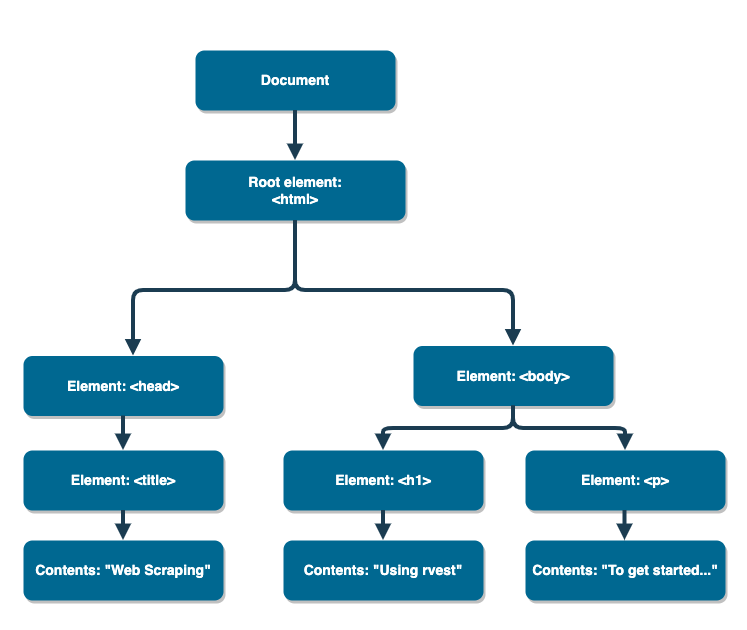

```{r include=FALSE}
knitr::opts_chunk$set(echo = TRUE, message = FALSE, warning = FALSE,
                      comment = "#>", highlight = TRUE,
                      fig.align = "center")
library(tidyverse)
```

## Supplementary materials

Full video lecture available in Zoom Cloud Recordings

Additional resources

- [SelectorGadget Vignette](https://cran.r-project.org/web/packages/rvest/vignettes/selectorgadget.html)
- `rvest` [website](https://rvest.tidyverse.org/)

---

class: inverse, center, middle

# Recap

---

## Summary of data-focused packages

.small-text[
| Task                | Package     | Cheat sheet                                                                  |
|---------------------|-------------|------------------------------------------------------------------------------|
| Visualize data      | `ggplot2`   | https://github.com/rstudio/cheatsheets/raw/master/data-visualization-2.1.pdf |
| Wrangle data frames | `dplyr`     | https://github.com/rstudio/cheatsheets/raw/master/data-transformation.pdf    |
| Reshape data frames | `tidyr`     | https://github.com/rstudio/cheatsheets/raw/master/data-import.pdf            |
| Iterate             | `purrr`     | https://github.com/rstudio/cheatsheets/raw/master/purrr.pdf                  |
| Text manipulation   | `stringr`   | https://github.com/rstudio/cheatsheets/raw/master/strings.pdf                |
| Manipulate factors  | `forcats`   | https://github.com/rstudio/cheatsheets/raw/master/factors.pdf                |
| Manipulate dates    | `lubridate` | https://github.com/rstudio/cheatsheets/raw/master/lubridate.pdf              |
| Spatial data        | `sf`        | https://github.com/rstudio/cheatsheets/raw/master/sf.pdf                     |
]

<br/>

<i>
You don't need to memorize every function in these packages. Just know
where you need to look when you come across a specific problem.
</i>

---

class: inverse, center, middle

# HTML

---

## Hypertext Markup Language

- HTML describes the structure of a web page; your browser interprets the 
  structure and contents and displays the results.
  
- The basic building blocks include elements, tags, and attributes.
    - an element is a component of an HTML document
    - elements contain tags (start and end tag)
    - attributes provide additional information about HTML elements

<center>

</center>

---

## Simple HTML document

```html
<html>
<head>
<title>Web Scraping</title>
</head>
<body>

<h1>Using rvest</h1>
<p>To get started...</p>

</body>
</html>
```

<br/><br/>

We can visualize this in a tree-like structure.

---

## HTML tree-like structure

<center>

</center>

If we have access to an HTML document, then how can we easily 
extract information?

---

class: inverse, center, middle

# Package `rvest`

---

## Package `rvest`

`rvest` is a package authored by Hadley Wickham that makes basic processing and 
manipulation of HTML data easy.

```{r}
library(rvest)
```

Core functions:

| Function            | Description                                                       |
|---------------------|-------------------------------------------------------------------|
| `xml2::read_html()` | read HTML from a character string or connection                   |
| `html_nodes()`      | select specified nodes from the HTML document using CSS selectors |
| `html_table()`      | parse an HTML table into a data frame                             |
| `html_text()`       | extract tag pairs' content                                        |
| `html_name()`       | extract tags' names                                               |
| `html_attrs()`      | extract all of each tag's attributes                              |
| `html_attr()`       | extract tags' attribute value by name                             |

---

## HTML in R


```{r}
simple_html <- "<html>
  <head>
    <title>Web Scraping</title>
  </head>
  <body>
  
    <h1>Using rvest</h1>
    <p>To get started...</p>
  
  </body>
</html>"
```

--

```{r}
simple_html
```

---

```{r}
html_doc <- read_html(simple_html)
attributes(html_doc)
```

--

<br/>

```{r}
html_doc
```

---

## CSS selectors

To extract components out of HTML documents use `html_nodes()` and CSS selectors.
In CSS, selectors are patterns used to select elements you want to style.

- CSS stands for Cascading Style Sheets.
 
- CSS describes how HTML elements are to be displayed on screen, paper, or 
  in other media.
 
- CSS can be added to HTML elements in 3 ways:
    - Inline - by using the style attribute in HTML elements
    - Internal - by using a style element in the head section
    - External - by using an external CSS file

---

## More on CSS

.small-text[

Selector          |  Example         | Description
:-----------------|:-----------------|:--------------------------------------------------
element           |  `p`             | Select all &lt;p&gt; elements
element element   |  `div p`         | Select all &lt;p&gt; elements inside a &lt;div&gt; element
element>element   |  `div > p`       | Select all &lt;p&gt; elements with &lt;div&gt; as a parent
.class            |  `.title`        | Select all elements with class="title"
#id               |  `#name`         | Select all elements with id="name"
[attribute]       |  `[class]`       | Select all elements with a class attribute
[attribute=value] |  `[class=title]` | Select all elements with class="title"

]

For more CSS selector references click [here](https://www.w3schools.com/cssref/css_selectors.asp).

--

<br/>

Fortunately, we can determine the necessary CSS selectors we need via the 
point-and-click tool [SelectorGadget](https://selectorgadget.com/). 
More on this in a moment.

---

## Example

URL: https://raysnotebook.info/ows/schedules/The%20Whole%20Shebang.html

.tiny[
```html
<html lang=en>
<head>
   <title>Rays Notebook: Open Water Swims 2020 — The Whole Shebang</title>
</head>
<body>
<main class=schedule>
<h1>The Whole Shebang</h1>

<p>This schedule lists every swim in the database. 383 events.</p>

<table class=schedule>
<thead><tr><th>Date</th><th>Location</th><th>Name</th><th>Distance</th>
<th>More</th></tr></thead>
<tbody>

<tr id=January>
<td class=date>Jan 12, Sun</td>
<td class=where>
   <a class=mapq href="http://www.google.com/maps/?q=27.865501,-82.631997">
   Petersburg, FL</a>
   <span class=more>
   Gandy Beach, Gandy Blvd N St, Petersburg, FL
   </span>
</td>
<td class=name><a href="http://tampabayfrogman.com/">Tampa Bay Frogman</a></td>
<td class=distance>5 km</td>
<td class=more><span class=time>7:15 AM</span>, Old Tampa Bay.</td>
</tr>
</body>
</html>
```
]

```{r echo=FALSE}
html_swim <- '<html lang=en>
<head>
   <title>Rays Notebook: Open Water Swims 2020 — The Whole Shebang</title>
</head>
<body>
<main class=schedule>
<h1>The Whole Shebang</h1>

<p>This schedule lists every swim in the database. 383 events.</p>

<table class=schedule>
<thead><tr><th>Date</th><th>Location</th><th>Name</th><th>Distance</th><th>More</th></tr></thead>
<tbody>

<tr id=January>
<td class=date>Jan 12, Sun</td>
<td class=where>
   <a class=mapq href="http://www.google.com/maps/?q=27.865501,-82.631997">Petersburg, FL</a>
   <span class=more>
   Gandy Beach, Gandy Blvd N St, Petersburg, FL
   </span>
</td>
<td class=name><a href="http://tampabayfrogman.com/">Tampa Bay Frogman</a></td>
<td class=distance>5 km</td>
<td class=more><span class=time>7:15 AM</span>, Old Tampa Bay.</td>
</tr>
</body>
</html>'
```

---

Suppose we want to extract and parse the information highlighted below in
yellow.

.tiny[
```{r eval=FALSE}
<html lang=en>
<head>
   <title>Rays Notebook: Open Water Swims 2020 — The Whole Shebang</title>
</head>
<body>
<main class=schedule>
<h1>The Whole Shebang</h1>

<p>This schedule lists every swim in the database. 383 events.</p> #<<

<table class=schedule>
<thead><tr><th>Date</th><th>Location</th><th>Name</th><th>Distance</th><th>More
</th></tr></thead>
<tbody>

<tr id=January>
<td class=date>Jan 12, Sun</td>
<td class=where>
   <a class=mapq href="http://www.google.com/maps/?q=27.865501,-82.631997">
  Petersburg, FL</a>
   <span class=more>
   Gandy Beach, Gandy Blvd N St, Petersburg, FL
   </span>
</td>
<td class=name><a href="http://tampabayfrogman.com/">Tampa Bay Frogman</a></td>
<td class=distance>5 km</td>
<td class=more><span class=time>7:15 AM</span>, Old Tampa Bay.</td>
</tr>
</body>
</html>
```
]

---

**Step 1**

Save the HTML as a character object named `html_swim`.

```{r eval=FALSE}
html_swim <- "<html lang=en> ... </body></html>"
```

--

**Step 2**

To extract all `<p>` elements:

```{r}
html_swim %>% 
  read_html() %>% 
  html_nodes(css = "p") #<<
```

--

**Step 3**

To extract the contents between the tags:

```{r}
html_swim %>% 
  read_html() %>% 
  html_nodes(css = "p") %>% 
  html_text() #<<
```

---

Suppose we want to extract and parse pieces of the information highlighted 
below in yellow.

.tiny[
```{r eval=FALSE}
<html lang=en>
<head>
   <title>Rays Notebook: Open Water Swims 2020 — The Whole Shebang</title>
</head>
<body>
<main class=schedule>
<h1>The Whole Shebang</h1>

<p>This schedule lists every swim in the database. 383 events.</p>

<table class=schedule>
<thead><tr><th>Date</th><th>Location</th><th>Name</th><th>Distance</th>
  <th>More</th></tr></thead>
<tbody>

<tr id=January>
<td class=date>Jan 12, Sun</td>
<td class=where> #<<
   <a class=mapq href="http://www.google.com/maps/?q=27.865501,-82.631997">#<<
  Petersburg, FL</a> #<<
   <span class=more> #<<
   Gandy Beach, Gandy Blvd N St, Petersburg, FL #<<
   </span> #<<
</td> #<<
<td class=name><a href="http://tampabayfrogman.com/">Tampa Bay Frogman</a></td>
<td class=distance>5 km</td>
<td class=more><span class=time>7:15 AM</span>, Old Tampa Bay.</td>
</tr>
</body>
</html>
```
]

---

To select all elements with `class="where"`:

```{r}
html_swim %>% 
  read_html() %>% 
  html_nodes(css = "[class=where]") #<<
```

--

To extract the text:

```{r}
html_swim %>% 
  read_html() %>% 
  html_nodes(css = "[class=where]") %>% 
  html_text() #<<
```

--

To extract the attributes and their values:

```{r}
html_swim %>% 
  read_html() %>% 
  html_nodes(css = "[class=where]") %>% 
  html_attrs() #<<
```

---

Suppose we want to extract and parse the information highlighted below in
yellow.

.tiny[
```{r eval=FALSE}
<html lang=en>
<head>
   <title>Rays Notebook: Open Water Swims 2020 — The Whole Shebang</title>
</head>
<body>
<main class=schedule>
<h1>The Whole Shebang</h1>

<p>This schedule lists every swim in the database. 383 events.</p>

<table class=schedule>
<thead><tr><th>Date</th><th>Location</th><th>Name</th><th>Distance</th>
  <th>More</th></tr></thead>
<tbody>

<tr id=January>
<td class=date>Jan 12, Sun</td>
<td class=where>
   <a class=mapq href="http://www.google.com/maps/?q=27.865501,-82.631997"> #<<
  Petersburg, FL</a> #<<
   <span class=more>
   Gandy Beach, Gandy Blvd N St, Petersburg, FL
   </span>
</td>
<td class=name><a href="http://tampabayfrogman.com/">Tampa Bay Frogman</a></td> #<<
<td class=distance>5 km</td>
<td class=more><span class=time>7:15 AM</span>, Old Tampa Bay.</td>
</tr>
</body>
</html>
```
]

---

To extract the links (those with an `href` attribute):

```{r}
html_swim %>% 
  read_html() %>% 
  html_nodes(css = "[href]") #<<
```

--

To get only the URLs (value of the `href` attribute):

```{r}
html_swim %>% 
  read_html() %>% 
  html_nodes(css = "[href]") %>% 
  html_attr("href") #<<
```


---

## SelectorGadget

[SelectorGadget](https://selectorgadget.com/) makes identifying the CSS 
selector you need by easily clicking on items on a webpage.

<center>
<iframe title="vimeo-player" src="https://player.vimeo.com/video/52055686" width="800" height="400" frameborder="0" allowfullscreen></iframe>
</center>

---

class: inverse, center, middle

# Live demo

---

## Example

Go to http://books.toscrape.com/catalogue/page-1.html and scrape the first 
five pages of data on books with regards to their

1. title
2. price
3. star rating
4. availability

Organize your results in a neatly formatted tibble similar to below.

```{r eval=FALSE}
# A tibble: 100 x 4
   title                                 price rating available
   <chr>                                 <chr> <chr>  <chr>    
 1 A Light in the Attic                  £51.… Three  In stock 
 2 Tipping the Velvet                    £53.… One    In stock 
 3 Soumission                            £50.… One    In stock 
 4 Sharp Objects                         £47.… Four   In stock 
 5 Sapiens: A Brief History of Humankind £54.… Five   In stock 
 6 The Requiem Red                       £22.… One    In stock 
 7 The Dirty Little Secrets of Getting … £33.… Four   In stock 
 8 The Coming Woman: A Novel Based on t… £17.… Three  In stock 
 9 The Boys in the Boat: Nine Americans… £22.… Four   In stock 
10 The Black Maria                       £52.… One    In stock 
# … with 90 more rows
```

???

## Solution


```{r eval=FALSE}

# example for page 1, see how everything works
url <- "http://books.toscrape.com/catalogue/page-1.html"
books_html <- read_html(url)

books_html %>% 
  html_nodes(css = ".price_color") %>% 
  html_text()

books_html %>% 
  html_nodes(css = ".product_pod a") %>% 
  html_attr("title") %>% 
  .[!is.na(.)]

books_html %>% 
  html_nodes(css = ".star-rating") %>% 
  html_attr(name = "class") %>% 
  str_remove(pattern = "star-rating ")

books_html %>% 
  html_nodes(css = ".availability") %>% 
  html_text() %>% 
  str_trim()


# turn our code into a function
get_books <- function(page) {
  
  base_url <- "http://books.toscrape.com/catalogue/page-"
  url <- str_c(base_url, page, ".html")
  
  books_html <- read_html(url)
  
  prices <- books_html %>% 
    html_nodes(css = ".price_color") %>% 
    html_text()
  
  titles <- books_html %>% 
    html_nodes(css = ".product_pod a") %>% 
    html_attr("title") %>% 
    .[!is.na(.)]

  ratings <- books_html %>% 
    html_nodes(css = ".star-rating") %>% 
    html_attr(name = "class") %>% 
    str_remove(pattern = "star-rating ")
  
  availabilities <- books_html %>% 
    html_nodes(css = ".availability") %>% 
    html_text() %>% 
    str_trim()
  
  books_df <- tibble(
    title     = titles,
    price     = prices,
    rating    = ratings,
    available = availabilities
  )
  
  return(books_df)
}

# iterate across pages

pages <- 1:5
books <- map_df(pages, get_books)
```

---

## Exercise

Scrape the first page of books from each genre in the side bar on the website
http://books.toscrape.com/. Scape the same information as before and include
the genre.

```{r eval=FALSE}
# A tibble: 517 x 5
   title                                price  rating available genre
   <chr>                                <chr>  <chr>  <chr>     <chr>
 1 It's Only the Himalayas              £45.17 Two    In stock  Trav…
 2 Full Moon over Noah’s Ark: An Odyss… £49.43 Four   In stock  Trav…
 3 See America: A Celebration of Our N… £48.87 Three  In stock  Trav…
 4 Vagabonding: An Uncommon Guide to t… £36.94 Two    In stock  Trav…
 5 Under the Tuscan Sun                 £37.33 Three  In stock  Trav…
 6 A Summer In Europe                   £44.34 Two    In stock  Trav…
 7 The Great Railway Bazaar             £30.54 One    In stock  Trav…
 8 A Year in Provence (Provence #1)     £56.88 Four   In stock  Trav…
 9 The Road to Little Dribbling: Adven… £23.21 One    In stock  Trav…
10 Neither Here nor There: Travels in … £38.95 Three  In stock  Trav…
# … with 507 more rows
```

---

## References

1. Easily Harvest (Scrape) Web Pages. (2021). Rvest.tidyverse.org. 
   https://rvest.tidyverse.org/.

2. W3Schools Online Web Tutorials. (2021). W3schools.com. 
   https://www.w3schools.com/.

3. SelectorGadget: point and click CSS selectors. (2021). Selectorgadget.com. 
   https://selectorgadget.com/.

